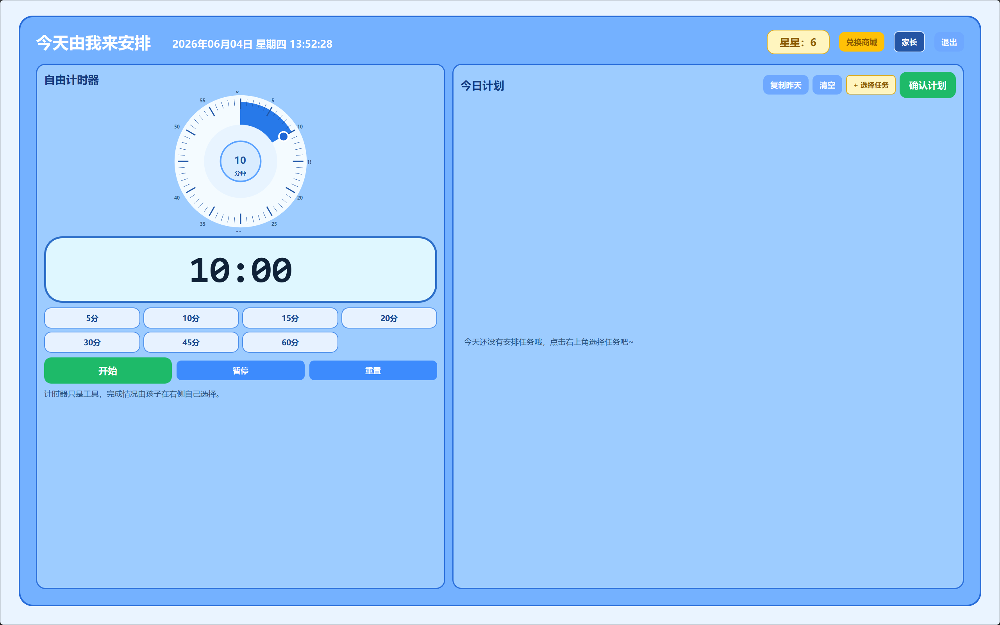
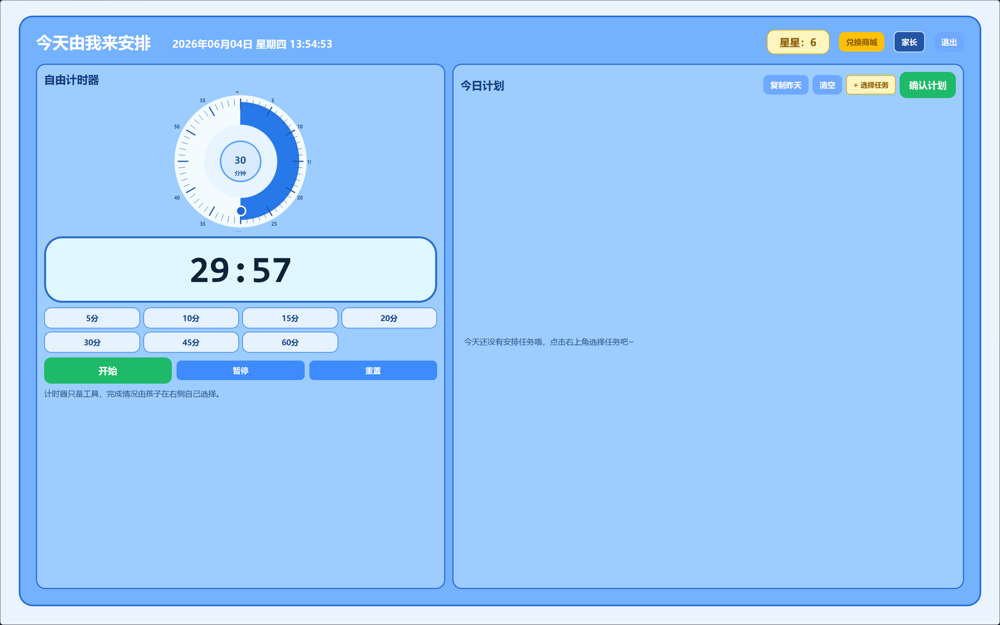
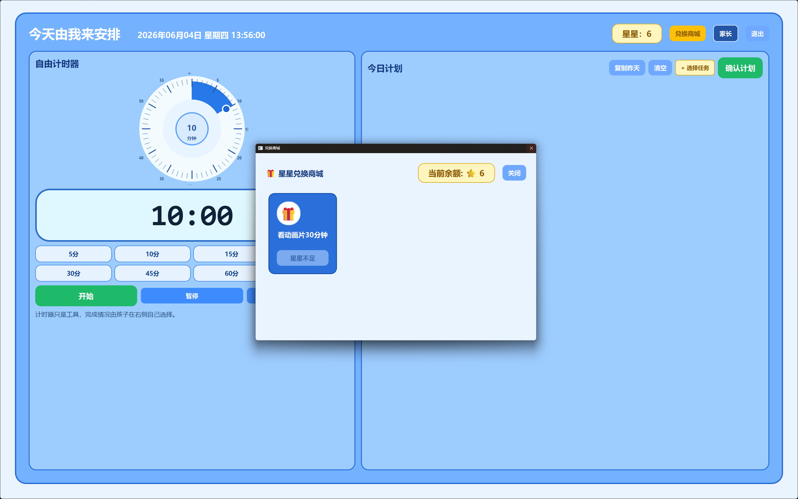
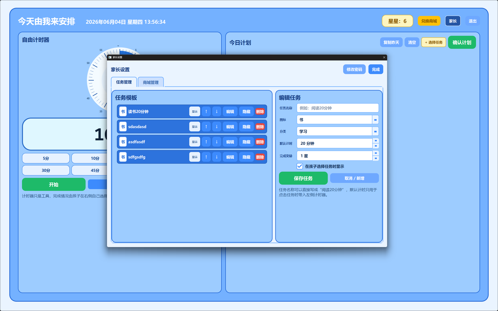

# 🌟 儿童自律打卡系统 (Child Self-Discipline Program)

一个专为儿童设计的自律养成与任务管理桌面软件。通过游戏化的“任务打卡”和“星星兑换”机制，帮助孩子养成良好的作息习惯和自主学习能力。 

Vibe Coding开发的，欢迎有需要的人下载使用
---

## 🎯 项目简介

本项目使用 **Python (PySide6)** 开发，分为**孩子端**和**家长端**。
孩子可以通过完成家长设定的日常任务（如阅读、做家务、练琴）来进行计时和打卡，并获得“星星”奖励；随后可以用积攒的星星在“兑换商城”中兑换家长承诺的奖励（如看动画片、买玩具）。
所有数据均保存在本地，家长可以方便地通过密码锁进入后台管理任务和商品。

---

## ✨ 核心功能

### 👦 孩子端 (Child Mode)
- **实时时钟仪表盘**：首页直观显示当前日期、星期和时间，培养孩子时间观念。
- **任务倒计时**：点击每日任务即可开始番茄钟倒计时，完成后自动发放星星。
- **倒计时提醒**：计时结束自动播放提示音（支持自定义铃声）。
- **兑换商城**：展示当前拥有的星星数量，孩子可以自主选择并兑换心仪的奖励。

### 👩‍🏫 家长端 (Parent Mode)
- **密码保护**：家长后台带有密码锁，防止孩子误操作。
- **任务管理**：自由添加、编辑、删除任务模板，设置每个任务的默认时长和完成后奖励的星星数。
- **商城管理**：上架或下架兑换商品，自定义商品名称和对应的星星价格。
- **状态追踪**：后台记录任务状态，并支持“撤销”操作（误点完成时可回滚星星）。

---

## 📸 界面预览

### 1. 孩子端首页
> 
### 2. 倒计时专注页面
> 
### 3. 星星兑换商城
> 
### 4. 家长管理后台
> 
---

## 🚀 下载与使用 (普通用户)

无需安装任何环境或代码，直接下载开箱即用：

1. 前往本项目的 [Releases 页面](https://github.com/您的用户名/您的仓库名/releases)。
2. 下载最新版本的 `ChildSelfDiscipline.zip` 压缩包。
3. 解压到电脑任意位置，双击运行 `ChildSelfDiscipline.exe` 即可使用。

**💡 自定义提示音：**
程序首次运行后，会在 exe 同级目录下自动生成一个 `data` 文件夹，里面包含了默认的 `lingsheng.wav` 提示音文件。您可以随时将该文件替换为您喜欢的同名 `.wav` 音频文件。

**默认家长密码：** `1234`（首次进入后请在设置中修改）

---

## 💻 源码运行与打包 (开发者)

如果您想对软件进行二次开发，请按照以下步骤操作：

### 1. 环境准备
确保您的电脑上安装了 Python 3.9+。
克隆本项目到本地后，安装依赖项：
```bash
git clone https://github.com/您的用户名/您的仓库名.git
cd child_self-discipline_program
pip install -r requirements.txt
```

### 2. 运行项目
```bash
python main.py
```

### 3. 打包为 EXE
项目使用 PyInstaller 进行打包，确保代码中的资源路径可以被正确解析：
```bash
pyinstaller -y --noconsole --name "ChildSelfDiscipline" --add-data "app/assets;app/assets" main.py
```
打包成功后，可执行文件位于 `dist/ChildSelfDiscipline` 目录下。

---

## 📂 目录结构说明

```text
child_self-discipline_program/
├── app/
│   ├── assets/          # 静态资源 (QSS样式表, 图片, 默认音效等)
│   ├── services/        # 核心业务逻辑 (计划管理, 奖励管理, 倒计时等)
│   ├── ui/              # PySide6 界面组件 (首页, 家长后台, 倒计时页等)
│   ├── config.py        # 全局路径及配置
│   ├── database.py      # SQLite 数据库初始化与访问
│   └── models.py        # 数据模型定义
├── data/                # 运行时生成的目录 (存放 app.db 和 自定义音效)
├── main.py              # 程序入口
├── requirements.txt     # Python 依赖
└── README.md            # 项目说明文档
```

---

## 📄 许可证

本项目基于 [MIT License](LICENSE) 开源。欢迎任何人下载、修改和分享！如果觉得对您的孩子有帮助，欢迎给个 ⭐️ Star！
